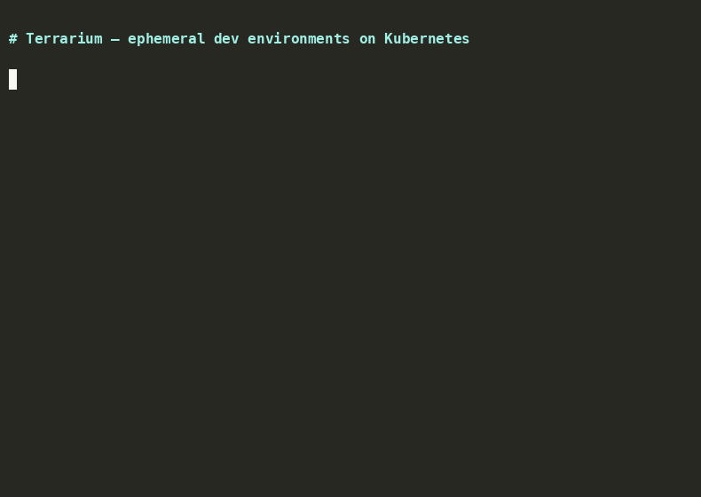

# Terrarium

[](https://github.com/poisoned-monkey/terrarium/releases)
[](https://goreportcard.com/report/github.com/poisoned-monkey/terrarium)
[](LICENSE)

Kubernetes operator for ephemeral per-branch developer environments. Declare your full stack — services, databases, queues — as a single `DevEnvironment` CRD. The operator provisions a dedicated namespace, wires up RBAC and secrets, syncs local code with hot-reload, and cleans up everything on deletion.

<p align="center">
  
</p>

## Features

- **Namespace** — auto-created from `spec.namespace` or derived from `spec.branch`
- **Stack** — Deployments + Services for app services, databases (Postgres, Redis, MySQL, MongoDB), and queues (Kafka, RabbitMQ, NATS)
- **RBAC** — RoleBinding in the dev namespace for specified subjects
- **Secrets / ConfigMaps** — copied from other namespaces or created from inline literals
- **Clean-up** — all resources carry an OwnerReference to the DevEnvironment CR; deleted automatically when the CR is removed
- **Live code sync & hot-reload** — a sync-receiver sidecar in the pod accepts files over HTTP; sync-client watches local paths and uploads changes, optionally triggering a reload command
- **Image build** — build-client builds an image from `build.context`/`dockerfile`, pushes it to a registry, and patches the Deployment

## Installation

### Helm (recommended)

```bash
# Install CRD
kubectl apply -k config/crd

# Add the repo and install
helm repo add terrarium https://poisoned-monkey.github.io/terrarium
helm repo update
helm install terrarium terrarium/terrarium -n terrarium-system --create-namespace
```

### Container image

Pre-built images are published to GitHub Container Registry:

```
ghcr.io/poisoned-monkey/terrarium:0.1.1
```

### From source

```bash
go mod tidy
make docker-build IMAGE=your-registry/terrarium:latest
make deploy

# Verify
kubectl get pods -n dev-environment-operator
```

The default image is `dev-environment-operator:latest`. To use your own registry:

```bash
make docker-build IMAGE=your-registry/terrarium:v0.1.0
# update image in config/operator/deploy.yaml and kubectl apply -f config/operator/deploy.yaml
```

## DevEnvironment example

See [config/samples/dev.example.com_v1alpha1_devenvironment.yaml](config/samples/dev.example.com_v1alpha1_devenvironment.yaml).

Minimal example (one service + one database):

```yaml
apiVersion: dev.example.com/v1alpha1
kind: DevEnvironment
metadata:
  name: my-dev
spec:
  namespace: dev-my-dev
  stack:
    services:
      - name: api
        image: nginx:alpine
        ports:
          - containerPort: 80
            name: http
    databases:
      - name: postgres
        type: postgres
        version: "15"
```

## Project structure

```
.
├── api/v1alpha1/              # DevEnvironment API types
├── cmd/
│   ├── manager/               # Operator entry point
│   ├── sync-receiver/         # HTTP sidecar for file upload and reload
│   ├── sync-client/           # CLI: watch + upload to pod (port-forward)
│   └── build-client/          # CLI: docker build + patch Deployment
├── controllers/               # Controller (reconciler)
├── config/
│   ├── crd/                   # CRD and kustomization
│   ├── samples/               # DevEnvironment samples
│   └── operator/              # Operator deployment manifests
├── images/sync-receiver/      # Dockerfile for sync-receiver
├── Dockerfile
├── Makefile
├── go.mod
└── README.md
```

### Live code sync & hot-reload

1. In the DevEnvironment, set `sync` on a service with the paths to watch and optionally a `command` for reload.
2. Build the sync-receiver image and make it available to the cluster (use the same tag referenced in the controller: `dev-environment-operator/sync-receiver:latest`, or override via the `SYNC_RECEIVER_IMAGE` env var on the operator):

   ```bash
   make docker-build-sync-receiver
   # for kind: kind load docker-image dev-environment-operator/sync-receiver:latest
   ```

3. Run sync-client from the root of the application repository (where the paths in `sync.paths` are located):

   ```bash
   make sync-client   # or: go build -o bin/sync-client ./cmd/sync-client
   bin/sync-client --devenv=my-dev --service=api --base-dir=.
   ```

   The client sets up a port-forward to the pod, watches for file changes, and uploads them. If `hotReload: true`, it calls `POST /reload` after each change. The application container has `/workspace` mounted — files land there, so a dev server (nodemon, air, etc.) can watch that directory.

### Building images with `build`

For a service that has `build.context` and `build.dockerfile`:

```bash
make build-client
bin/build-client --devenv=my-dev --service=api --base-dir=/path/to/repo
```

By default the image is tagged as `$REGISTRY/dev-<devenv>-<service>:latest` (REGISTRY from env, defaults to `dev-environment`). You can set the image explicitly with `--image=myreg.com/myapp:dev`. After the build the image is pushed to the registry (unless `--no-push` is set), then the Deployment image in the cluster is updated.

## Not yet implemented

- **TTL on idle** (`ttlSecondsAfterIdle`) — field is defined in the spec but the controller does not act on it yet.

## Testing

See [TESTING.md](TESTING.md) for a full step-by-step guide. Quick summary:

- **Local (kind/minikube):** install the CRD, run `go run ./cmd/manager`, apply a sample, and verify with `kubectl get devenvironments` and `kubectl get all -n dev-simple`.
- **Unit tests:** `go test ./controllers/... -v`.
- **Sync:** load the sync-receiver image into the cluster, apply a DevEnvironment with `sync`, run `bin/sync-client --devenv=... --service=...`.
- **Build:** `bin/build-client --devenv=... --service=... --base-dir=...`.

## Code generation (controller-gen)

```bash
go install sigs.k8s.io/controller-tools/cmd/controller-gen@latest
controller-gen object paths=./api/...
controller-gen crd paths=./api/... output:crd:dir=config/crd/bases
```
